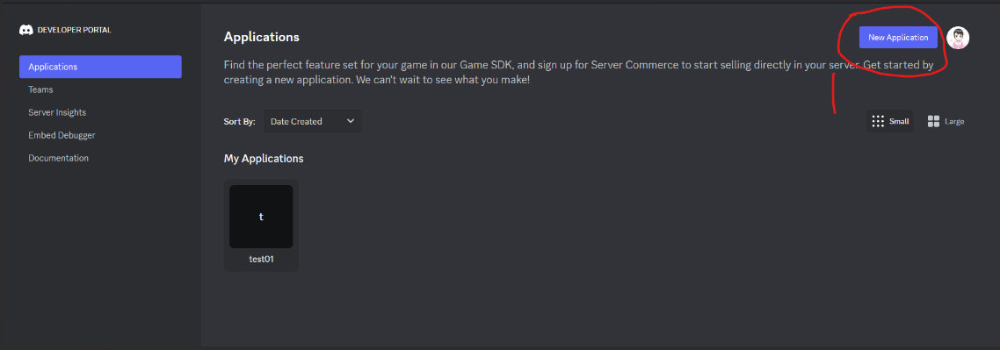
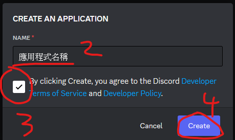
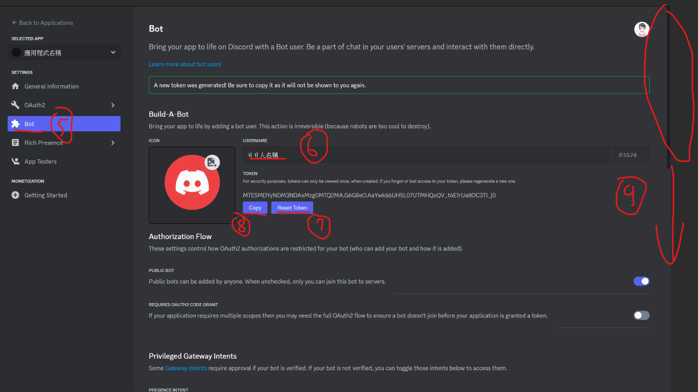
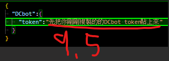
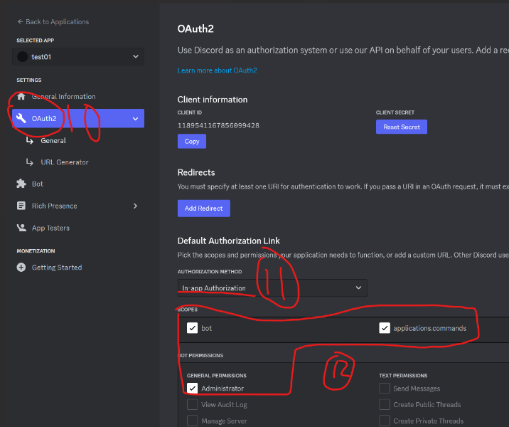
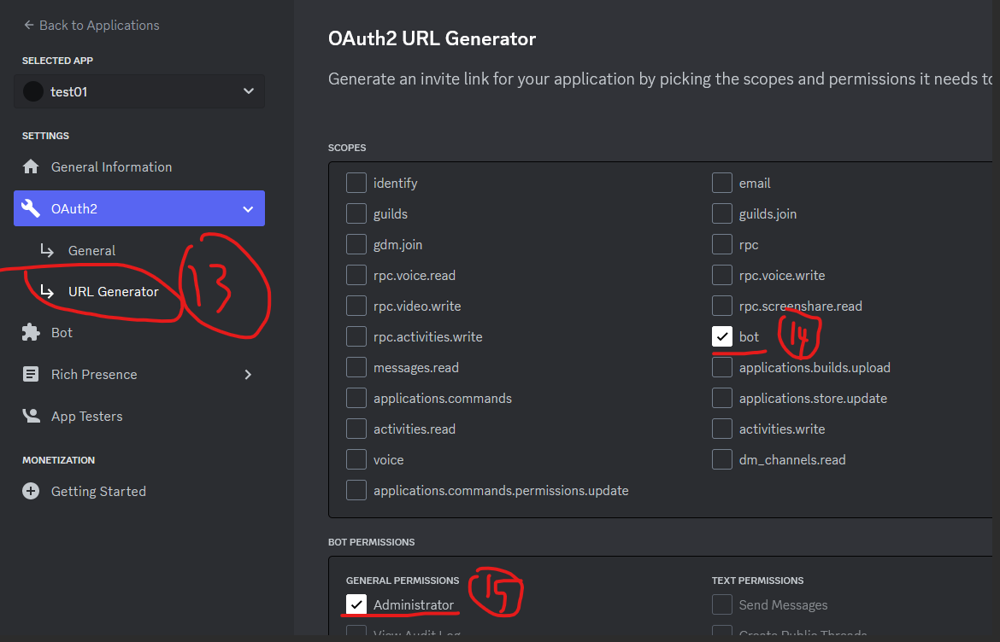
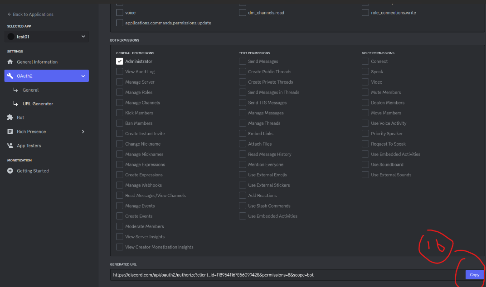
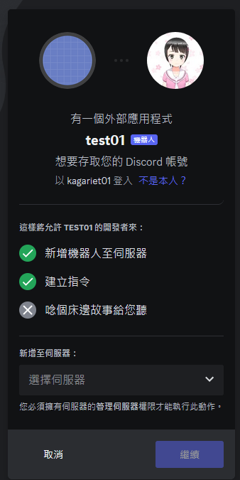
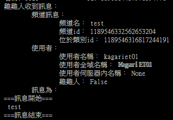

# 建立bot
先到<https://discord.com/developers>  
先建立一個應用程式  
  
  
建立bot  
  
打開 `cfg.json`，把Token貼上去，避免忘記  
  
把這三個勾起來  
  
p.s. 第12部是設定bot的權限，可視需要自行調整
  
p.s. 第15部是設定bot的權限，可視需要自行調整
  
他會產生bot邀請連結，你可以把它加入至你有管理權限的伺服器
  
連到該網址，把ㄐㄐ人加到你要的server  
  

# 連線bot
1. 修改 `cfg.json` 內的token
2. 將 `cfg.json` 移動到 `../cfg.json`
3. 執行 `python3 main.py`  
4. `main.py` 會隨時輸出誰在哪裡傳了什麼訊息  
	